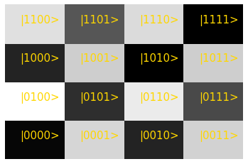
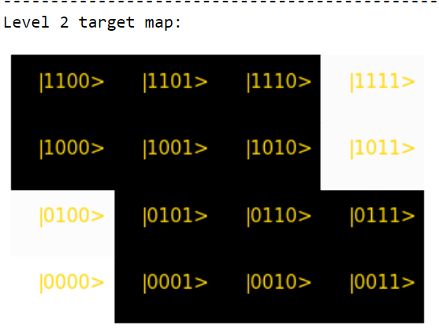
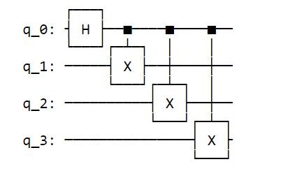
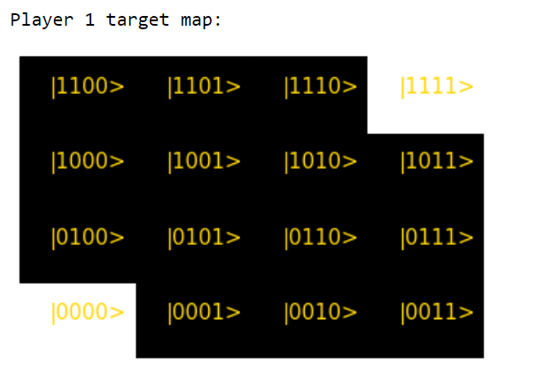
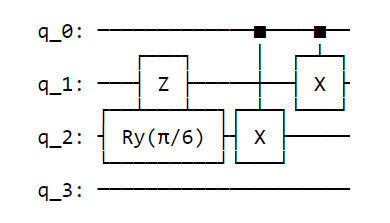
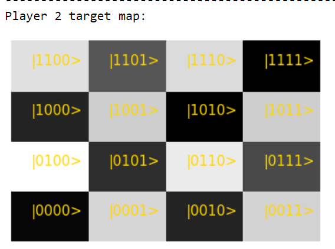
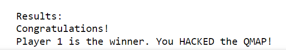

  

Guess the terrain of the quantum map!

## Team

Sumit Suresh Kale, Rishabh Gupta, Shree Hari Sureshbabu, Shah Ishmam Mohtashim

## What is 'Hack the QMap'? 
Hack the QMap is a game powered by quantum computing where the players of the game have to build quantum circuits, gate by gate in each move of the game, to generate terrain which is as close to the original terrain generated by our quantum game engine! (circuits).

This game is ***marriage*** between two challenges given to the participants from IonQ + Microsoft @ MIT iQuHACK 2022:
* Using a quantum computer to procedurally generate maps
* Using quantum logic itself as a gaming mechanism for both fun **AND** education!

***The motivation behind developing this game is to help participants to understand abstract quantum mechanical concepts of superposition and entanglement via understanding the varied probabilites of basis states with the applicaton of different quantum gates in an intuitive, visual manner***

## Quantum Game Engine for Map Generation
Random map generation is an important part of game design. Map generation can not be completely random as it is subject to the constraints of being aesthetic, having some sort of symmetry yet unique, being relevant to the experience of the game, and solvable as well. Meeting all these constraints means repetition of some set models, which undermines the uniqueness of the game content. Hence, satisfying all these constraints and still providing a fresh experience every time is a mammoth task. For our game, we have used the power of quantum computing to help us with this 'seemingly impossible task.

The generated map is simply a form of representation of the probability distributions of the basis states. Each block in the lattice represents a basis state and the colour of the blocks is determined by the probability of getting that state. The blocks will be darker for states whose probability is low, and lighter for high probability states. The lowest probabilities are made black, the highest is white and the scaling of the shading is logarithmic.

The probabilities of the states are generated by our quantum game engine i.e set of quantum circuits where we have included randomness during parameter selection of the rotation gates but ensured that the final wavefunction generated is in the entangled regime. 

Example maps for level two of the game:

.png) 
  
  

## Playing the game: Elements and Rules

There are three levels of this game: Easy: level 1 (2 qubits), Medium: level 2 (4 qubits) and Hard: level 3 (6 qubits)

* Level 1 has 2*2= 4 blocks map (You are allowed to use 2 Gates at max)
* Level 2 has 4*4= 16 blocks map (You are allowed to use 4 Gates at max)
* Level 3 has 6*6= 36 blocks map (You are allowed to use 6 Gates at max)
 
*Gameplay:*
1) In round 1, at first, the players will be shown a target map. Both the players have to choose an initial state. The options are |0>⊗n, |1>⊗n and (|0> + |1>)/sqrt(2)⊗n.
2) In the following rounds, players have to add quantum gates to form the quantum circuit. Options are:

    * 0: X        (1-qubit)
    * 1: Y        (1-qubit)
    * 2: Z        (1-qubit)
    * 3: H        (1-qubit)
    * 4: Rx(pi/k) (1-qubit)
    * 5: Ry(pi/k) (1-qubit)
    * 6: CNOT     (2-qubit)

    Players will also have to select the position of the gates and the parameter value (k) of the rotation gates.

3) Finally, the quantum circuits created by the players and the corresponding generated maps will be shown for visualization. The players' generated map will be compared with the target map. The player with the closest guess will win! *If the closest guess is at least 70 percent or more similar to the target map, otherwise no one wins :'(*

## Sample Gameplay
Generated target map:

Player 1 circuit after all rounds:

 

Player 1 generated map:

Player 2 circuit after all rounds: 

Player 2 generated map:

Who is the winner?

#### Implementation
We have used qiskit, python numpy, matplotlib for generating the map, and implimented it on quantum processing unit (qpu) provided by IonQ from the Microsoft Azure interface.

### Future Work
* The Wild: For a future bonkers variant of the game, players will be allowed to disrupt other players' circuits by allowing them to use two qubit entangling gates on each other circuits. This will be a power up which you can only use only once (Use this quantum power wisely) 
* The Artsy: The generated maps can include more colours and shapes and thus, users can make different artworks by varying the components of the circuits. 

##  Our personal experiences at MIT iQuHACK 2022 
None of our team members had made games before. So, thinking about a quantum computing project like a game designer, where we had to think about how the rounds should be played, how to make it fun and educational, etc, was something new and exciting for us all. We had a fun time brainstorming ideas and making the game work! Working accross different time zones was a bit stressfull at some poit but it helped us to run the project 24x7. We would like to thank the sponsors, the mentors and the organizing committee for providing the needfull resouces and all the help needed during the hackathon!
