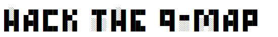

  

Guess the terrain of the quantum map!

## Team

Sumit Suresh Kale, Rishabh Gupta, Shree Hari Sureshbabu, Shah Ishmam Mohtashim

## What is 'Hack the QMap'? 
Hack the QMap is a game powered by quantum computing where the players of the game have to build quantum circuits, gate by gate in each move of the game, to generate terrain which is as close to the original terrain generated by our quantum game engine!(circuits).

This game is the marriage between the two of the challenge ideas of the IonQ + Microsoft Joint Challenge @ MIT iQuHACK 2022:
* Using a quantum computer to procedurally generate maps
* Using quantum logic itself as a gaming mechanism for both fun **AND** education!

## Qunatum Game Engine for Map Generation
Random map generation is an important part of game design. Map generation can not be completely random as it is subject to the constraints of being aesthetic, having some sort of symetry yet unique, being relevant to the experince of the game and solvable as well. Meeting all these contraints means repeatation of some set models, which undermines the uniqueness of the game content. Hence, satisfying all these and constraints and still providing a fresh experience everytime is a mammoth task. For our game, we have used the power of quantum computing to help us with this 'seemingly impossible' task.

The generated map is simply a form of representation of the probabilty distributions of the basis states. Each block in the lattice represents a basis state and the colour of the blocks are determined by the probabilty of getting that state. The blocks will be darker for states whose probability is low, and lighter for high probability states. The lowest probabilities are made black, the highest are white and the scaling of the shading is logarithmic.

The probabilites of the states are generated by our quantum game engine i.e set of quantum ciruits where we have included randomness during parameter selection of the rotation gates but ensured that the final wavefunction generated is in the entangled regime. 

Example generated map for level two of the game:

.png)  

## Playing the game: Elements and Rules

There are three levels of this game: Easy: level 1 (2 qubits), Medium: level 2 (4 qubits) and Hard: level 3 (6 qubits)

* Level 1 has 2*2=4 blocks map
* Level 2 has 4*4=16 blocks map
* Level 3 has 6*6=36 blocks map
 
Example gameplay:
1) In round 1, at first, the players will be shown a target map. Both the players have to choose an initial state. The options are |0>⊗n, |1>⊗n and (|0> + |1>)/sqrt(2)⊗n.
2) In following rounds, players have to add quantum gates to form the quantum circuit. Options are:

    * 0: X        (1-qubit)
    * 1: Y        (1-qubit)
    * 2: Z        (1-qubit)
    * 3: H        (1-qubit)
    * 4: Rx(pi/k) (1-qubit)
    * 5: Ry(pi/k) (1-qubit)
    * 6: CNOT     (2-qubit)

Players will also have to select the position of the gates and the rotation value of the rotation gates.

3) Finally, the quantum circuits created by the players and the corresponding generated maps will be shown for visualization. The players' generated map will be compared with the target map. The player with the closest guess will win! *If the closest guess is atleast 70 percent or more similar to the target map, otherwise no one wins :'(*

#### Implementation
We have used python numpy, matplotlib for generating the map and qiskit for the quantum circuits. 

### Future Work
* The Wild: For a future wild(?!) variant of the game, players can be given a chance to disrupt the other players' circuit by entangling the two circuits. The chance can a special powerup or wildcard that can be used only once. 
* The Artsy: The generated maps can include more colours and shapes and thus, users can make different artworks by varying the components of the circuits. 
